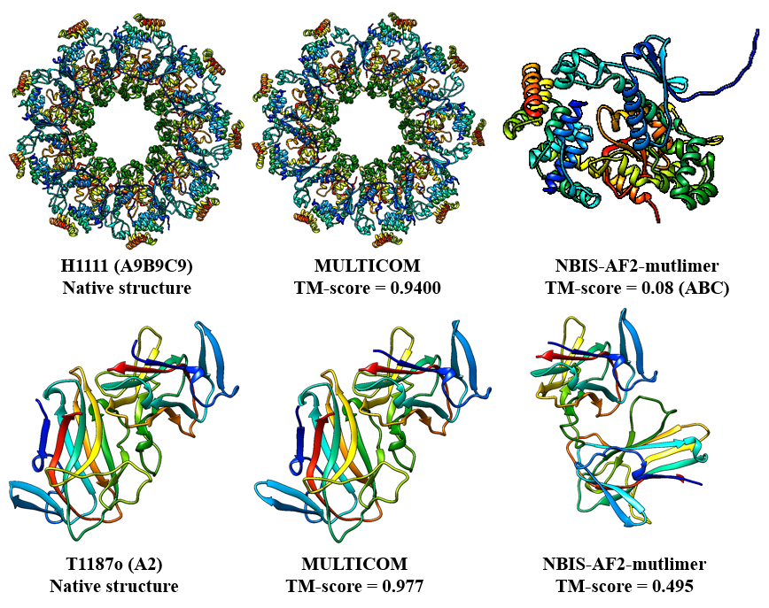

# MULTICOM3 
MULTICOM3 is an addon package to improve AlphaFold2- and AlphaFold-Multimer-based predition of protein tertiary and quaternary structures by diverse multiple sequene alignment sampling, template identification, model evaluation and model refinement. It can improve AlphaFold2-based tertiary structure prediction by 8-10% and AlphaFold-Multimer-based quaternary structure prediciton by 5-8%. In CASP15, MULTICOM3 used AlphaFold v2.2 as the engine to generate models. In this release, it is adjusted to run on top of AlphaFold v2.3 (https://github.com/deepmind/alphafold/releases/tag/v2.3.2) to leverage the latest improvement on AlphaFold2. You can install MULTICOM3 on top of your AlphaFold2 and AlphaFold-Multimer to improve both tertiary structure prediciton of monomers and quaternary structure prediction of multimers. 

## Overall workflow


# Installation

## Python virtual environment

Our system is built on top of AlphaFold2/AlphaFold-Multimer, please follow the installation guide here: https://github.com/kalininalab/alphafold_non_docker to install the required python packages to run AlphaFold2/AlphaFold-Multimer, then run the following commands to install the additional packages required in our system.

```
conda install tqdm

# install ColabFold
pip install "colabfold[alphafold] @ git+https://github.com/sokrypton/ColabFold"

# install mmseqs2
conda install -c conda-forge -c bioconda mmseqs2=14.7e284 -y
```
## Configuration for the system
The python script will 
* Download the additional databases
* Download the required tools in the system
* Copy the alphafold_addon scripts
* Create the configuration file (bin/db_option) for running the system

```
python setup.py --envidr $YOUR_PYTHON_ENV --af_dir $YOUR_ALPHAFOLD_DIR --afdb_dir $YOUR_ALPHAFOLD_DB_DIR

# e.g, 
# python setup.py \
# --envdir /home/multicom3/anaconda3/envs/MULTICOM_dev/ \
# --af_dir /home/multicom3/tools/alphafold_v2.3.2/ \
# --afdb_dir /home/multicom3/tools/alphafold_databases/
```

### Genetic databases

Assume the following databases have been installed as a part of the AlphaFold2/AlphaFold-Multimer
*   [BFD](https://bfd.mmseqs.com/),
*   [MGnify](https://www.ebi.ac.uk/metagenomics/),
*   [PDB70](http://wwwuser.gwdg.de/~compbiol/data/hhsuite/databases/hhsuite_dbs/),
*   [PDB](https://www.rcsb.org/) (structures in the mmCIF format),
*   [PDB seqres](https://www.rcsb.org/)
*   [UniRef30](https://uniclust.mmseqs.com/),
*   [UniProt](https://www.uniprot.org/uniprot/),
*   [UniRef90](https://www.uniprot.org/help/uniref).

Additional databases will be installed for the MULTICOM system:
*   [AlphaFoldDB](https://alphafold.ebi.ac.uk/): ~53G
*   [ColabFold database](https://colabfold.mmseqs.com/): ~1.7T
*   [Integrated Microbial Genomes (IMG)](https://img.jgi.doe.gov/): ~1.5T
*   [Metaclust](https://metaclust.mmseqs.org/current_release/): ~114G
*   [STRING](https://string-db.org/cgi/download?sessionId=bgV6D67b9gi2): ~129G
*   [pdb_complex](https://www.biorxiv.org/content/10.1101/2023.05.16.541055v1): ~38G
*   [pdb_sort90](https://www.biorxiv.org/content/10.1101/2023.05.01.538929v1): ~48G
*   [Uniclust30](https://uniclust.mmseqs.com/): ~87G

# Important parameters in bin/db_option for AlphaFold2/AlphaFold-Multimer
Please refer to [AlphaFold2](https://github.com/deepmind/alphafold) to understand the meaning of the following parameters. The parameters will apply to all the AlphaFold2/AlphaFold-Multimer variants in our system to generate models.
```
# AlphaFold2 parameters
monomer_num_ensemble = 1
monomer_num_recycle = 3
num_monomer_predictions_per_model = 5

# AlphaFold-Multimer parameters
multimer_num_ensemble = 1
multimer_num_recycle = 3
num_multimer_predictions_per_model = 10
```

# Running the monomer/teritary structure prediction pipeline

```bash
python bin/monomer.py \
    --option_file=bin/db_option \
    --fasta_path=$YOUR_FASTA \
    --run_img=False \
    --output_dir=$OUTDIR
```
Please be aware that we have included a parameter (--run_img) that allows you to turn off the usage of IMG database for faster prediction (--run_img=False). In the case of --run_img=True, the program will pause at the monomer model generation stage to wait for the IMG alignment to be created. Generating alignments from IMG may take a much longer time, potentially several days, because the database is very large. So run_img is set to false by default. It is advised that run_img is set to true only if other alignments cannot yield good results. 

# Running the multimer/quaternary structure prediction pipeline

```bash
# For homo-multimer
python bin/homomer.py \
    --option_file=bin/db_option \
    --fasta_path=$YOUR_FASTA \
    --run_img=False \
    --output_dir=$OUTDIR

# For hetero-multimer
python bin/heteromer.py \
    --option_file=bin/db_option \
    --fasta_path=$YOUR_FASTA \
    --run_img=False \
    --output_dir=$OUTDIR
```

# Examples

## Folding a monomer

Say we have a monomer with the sequence `<SEQUENCE>`. The input fasta should be:

```fasta
>sequence_name
<SEQUENCE>
```

Then run the following command:

```bash
python bin/monomer.py \
    --option_file=bin/db_option \
    --fasta_path=monomer.fasta \
    --output_dir=outdir
```

## Folding a homo-multimer

Say we have a homomer with 4 copies of the same sequence
`<SEQUENCE>`. The input fasta should be:

```fasta
>sequence_1
<SEQUENCE>
>sequence_2
<SEQUENCE>
>sequence_3
<SEQUENCE>
>sequence_4
<SEQUENCE>
```

Then run the following command:

```bash
python bin/homomer.py \
    --option_file=bin/db_option \
    --fasta_path=homomer.fasta \
    --output_dir=outdir
```

## Folding a hetero-multimer

Say we have an A2B3 heteromer, i.e. with 2 copies of
`<SEQUENCE A>` and 3 copies of `<SEQUENCE B>`. The input fasta should be:

```fasta
>sequence_1
<SEQUENCE A>
>sequence_2
<SEQUENCE A>
>sequence_3
<SEQUENCE B>
>sequence_4
<SEQUENCE B>
>sequence_5
<SEQUENCE B>
```

Then run the following command:

```bash
python bin/heteromer.py \
    --option_file=bin/db_option \
    --fasta_path=heteromer.fasta \
    --output_dir=outdir
```

## Output

### Monomer

```
$OUTPUT_DIR/                                   # Your output directory
    N1_monomer_alignments_generation/          # Working directory for generating monomer MSAs
    N1_monomer_alignments_generation_img/      # Working directory for generating IMG MSA
        # Note: the img.running file may use many disk space
    N2_monomer_template_search/                # Working directory for searching monomer templates
    N3_monomer_structure_generation/           # Working directory for generating monomer structural models
    N4_monomer_structure_evaluation/           # Working directory for evaluating the monomer structural models
        - alphafold_ranking.csv    # AlphaFold2 pLDDT ranking
        - pairwise_ranking.tm      # Pairwise (APOLLO) ranking
        - pairwise_af_avg.ranking  # Average ranking of the two
    N5_monomer_structure_refinement_avg/       # Working directory for monomer structure refinement
    N5_monomer_structure_refinement_avg_final/ # Output directory for the refined monomer models
        - final_ranking.csv        # AlphaFold2 pLDDT ranking of the original and refined models
```

* The models and ranking files are saved in *N4_monomer_structure_evaluation* folder. You can check the alphafold pLDDT score ranking file (alphafold_ranking.csv) to look for the structure with the highest pLDDT score. The *pairwise_ranking.tm* and *pairwise_af_avg.ranking* are the other two ranking files. 

* The refined monomer models are saved in *N5_monomer_structure_refinement_avg_final*.

### Multimer (Homo-multimer and hetero-multimer)

```
$OUTPUT_DIR/                                   # Your output directory
    N1_monomer_alignments_generation/          # Working directory for generating monomer MSAs
        - Subunit A
        - Subunit B
        - ...
    N1_monomer_alignments_generation_img/      # Working directory for generating IMG MSA
        - Subunit A
        - Subunit B
        - ...
    N2_monomer_template_search/                # Working directory for searching monomer templates
        - Subunit A
        - Subunit B
        - ...
    N3_monomer_structure_generation/           # Working directory for generating monomer structural models
        - Subunit A
        - Subunit B
        - ...
    N4_complex_alignments_concatenation/       # Working directory for concatenating the monomer MSAs
    N5_complex_templates_search/               # Working directory for concatenating the monomer templates
    N6_quaternary_structure_generation/        # Working directory for generating multimer structural models
    N7_monomer_structure_evaluation            # Working directory for evaluating monomer structural models
        - Subunit A
            # Rankings for all the models
            - alphafold_ranking.csv            # AlphaFold2 pLDDT ranking 
            - pairwise_ranking.tm              # Pairwise (APOLLO) ranking
            - pairwise_af_avg.ranking          # Average ranking of the two 

            # Rankings for the models generated by monomer structure prediction
            - alphafold_ranking_monomer.csv    # AlphaFold2 pLDDT ranking 
            - pairwise_af_avg_monomer.ranking  # Average ranking 

            # Rankings for the models extracted from multimer models
            - alphafold_ranking_multimer.csv   # AlphaFold2 pLDDT ranking 
            - pairwise_af_avg_multimer.ranking # Average ranking 

        - Subunit B
        - ...
    N8_multimer_structure_evaluation           # Working directory for evaluating multimer structural models
        - alphafold_ranking.csv                # AlphaFold2 pLDDT ranking
        - multieva.csv                         # Pairwise ranking using MMalign
        - pairwise_af_avg.ranking              # Average ranking of the two
    N9_multimer_structure_refinement           # Working directory for refining multimer structural models
    N9_multimer_structure_refinement_final     # Output directory for the refined multimer models
```

* The models and ranking files are saved in *N8_multimer_structure_evaluation*, similarly, you can check the alphafold confidence score ranking file (alphafold_ranking.csv) to look for the structure with the highest predicted confidence score generated by AlphaFold-Multimer. The *multieva.csv* and *pairwise_af_avg.ranking* are the other two ranking files.

* The refined multimer models are saved in *N9_multimer_structure_refinement_final*.

* The monomer structures and ranking files are saved in *N7_monomer_structure_evaluation* if you want to check the models and rankings for the monomer structures.

## Some CASP15 Prediction Examples (MULTICOM versus the Standard AlphaFold method: NIBS-AF2-multimer)




# Citing this work

**If you use the code or data in this package for tertiary or quaternary structure prediction, please cite:**

**Tertiary (monomer) structure prediction**

Jumper, J., Evans, R., Pritzel, A., Green, T., Figurnov, M., Ronneberger, O., ... & Hassabis, D. (2021). Highly accurate protein structure prediction with AlphaFold. Nature, 596(7873), 583-589.

Liu, J., Guo, Z., Wu, T., Roy, R. S., Chen, C., & Cheng, J. (2023). Improving AlphaFold2-based Protein Tertiary Structure Prediction with MULTICOM in CASP15. bioRxiv, 2023-05-01. (https://www.biorxiv.org/content/10.1101/2023.05.01.538929v1) 

**Quaternary (multimer) structure prediction**

Evans, R., O’Neill, M., Pritzel, A., Antropova, N., Senior, A., Green, T., ... & Hassabis, D. (2021). Protein complex prediction with AlphaFold-Multimer. BioRxiv, 2021-10.
 
Liu, J., Guo, Z., Wu, T., Roy, R. S., Quadir, F., Chen, C., & Cheng, J. (2023). Enhancing AlphaFold-Multimer-based Protein Complex Structure Prediction with MULTICOM  in CASP15. bioRxiv, 2023-05-16. (https://www.biorxiv.org/content/10.1101/2023.05.16.541055v1)


